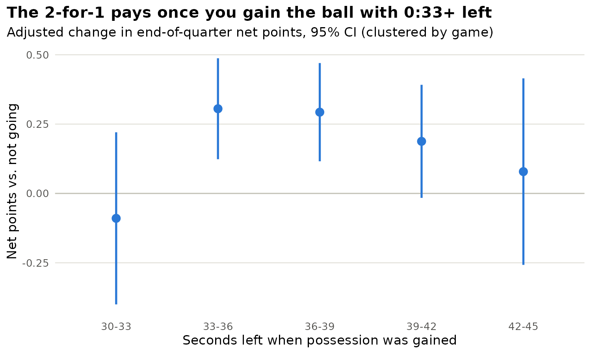
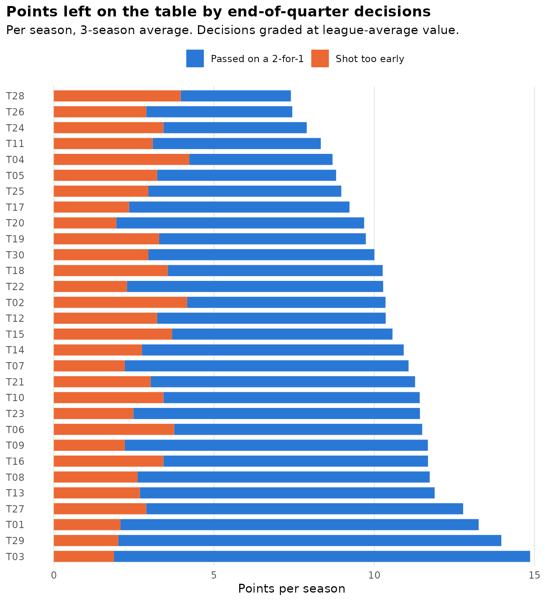

# The 2-for-1 Ledger

**An independent analysis of NBA end-of-quarter clock management.**
When a team gains the ball with roughly 30–45 seconds left in a quarter, it can shoot quickly
so that it gets the ball back for a final shot after the opponent uses its 24-second clock:
two possessions for the opponent's one. Commentators treat the "2-for-1" as free points.
This project measures how much it is actually worth, when it stops working, and how many
points each team leaves on the table.

Author: Viktor Bergs · SQL (DuckDB) · R · Python

> **Data note.** The play-by-play is **simulated** (3 seasons, 3,690 games, 127,163 events)
> and mirrors the NBA Stats PlayByPlayV3 schema. Teams are anonymized as T01–T30. Because the
> data is simulated, the true effect is known, which lets the project check whether the
> methods recover it (they do; see Validation). Swap in a real nba_api pull to run it on real games.

---

## Findings

| # | Finding | Number |
|---|---|---|
| 1 | Going 2-for-1 is worth about **+0.2 net points** per opportunity | OLS +0.221 (95% CI 0.125–0.316) · IPW +0.172 (0.067–0.271) |
| 2 | The naive comparison **overstates** the value by ~36% because 2-for-1 teams more often start from a live-ball turnover and with more time left | Naive +0.293 vs. true +0.215 |
| 3 | The gain shows up once a team gains the ball with **0:33 or more**. Below that, the rushed first shot eats most of it | 0:30–0:33: −0.09 (CI −0.40 to 0.22) · 0:33–0:36: +0.31 (0.12 to 0.49) |
| 4 | Shooting **too early** (0:34+ left) gives the opponent its own 2-for-1 | Opponent counter rate 19% → 52% · −0.20 net points |
| 5 | The median team leaves **10.5 points per season** on the table; best-to-worst gap is 7.5 points (≈0.25 wins) | League total ≈ 317 points/season |

<p align="center">
  
</p>

Coaching rule that falls out of it: **go when you gain the ball with 0:33+, shoot between 0:34 and 0:28, and below 0:32 take a normal possession.**

---

## Project structure

```
nba-2for1-analysis/
├── run_all.sh                     # rebuilds everything end to end
├── python/
│   ├── 00_simulate_pbp.py         # synthetic PlayByPlayV3-style event log
│   ├── run_sql.py                 # runs sql/*.sql in DuckDB, logs every result set
│   ├── 99_ground_truth.py         # replays windows under forced decisions (validation)
│   └── build_report.py            # fills report/template.html from output/tables
├── sql/
│   ├── 01_stage.sql               # load CSVs, parse ISO clock, tag ball owner
│   ├── 02_possessions.sql         # rebuild possessions with window functions
│   ├── 03_windows.sql             # one row per 2-for-1 opportunity + outcomes
│   └── 04_descriptives.sql        # raw cuts: summary, by clock, shot timing, team adoption
├── R/
│   ├── 01_effect_models.R         # naive vs OLS (clustered SE) vs IPW (cluster bootstrap)
│   ├── 02_when_it_works.R         # effect by clock bucket, "too early" analysis, figures
│   └── 03_team_value.R            # decision-graded points/wins left per team
├── data/
│   ├── raw/                       # pbp_eoq.csv.gz, games.csv, teams.csv, team_season_ratings.csv
│   └── processed/eoq_windows.csv  # SQL output, input to R
├── output/
│   ├── tables/                    # every number in the write-up
│   ├── figures/                   # ggplot2 PNGs
│   └── logs/                      # full SQL + R console output
└── report/
    ├── template.html              # case-study page layout
    └── the_2for1_ledger.html      # built page (open in a browser)
```

## How to run

```bash
pip install duckdb numpy pandas
Rscript -e 'install.packages(c("readr","dplyr","tidyr","purrr","sandwich","lmtest","ggplot2","scales"))'
bash run_all.sh
```

Everything is seeded, so a rerun reproduces the same numbers. The case-study page is `report/the_2for1_ledger.html`; download it and open it in a browser (GitHub shows HTML files as source).

---

## Method

**Unit of analysis: the window.** The first possession in Q1–Q3 that a team gains with 0:30–0:45
on the game clock. Q4 and OT are excluded because intentional fouls and score state change the
incentives. 9,581 of 11,070 quarters (86.5%) produce a window.

**Treatment.** `went_2for1 = 1` when the team's first shot decision (field-goal attempt, turnover,
or drawing a shooting foul) happens with ≥ 0:28 left, early enough to get the ball back after a
full opponent shot clock.

**Outcome.** Team points minus opponent points from the window to the buzzer.

**Rebuilding possessions in SQL.** Raw play-by-play has no possession column. `02_possessions.sql`
assigns each event a ball owner (fouls go to the fouled team), increments a possession counter
with `LAG()` + a running `SUM()` whenever the owner changes (so offensive rebounds extend a
possession), and dates each possession to the event that handed the ball over: the defensive
rebound itself, or the previous possession's make, turnover or last free throw.

**Estimators (R).**
1. Naive difference in means.
2. OLS with controls for start-clock bucket, how the ball was gained, period, season, team offensive
   rating, opponent defensive rating, score margin and home court. Standard errors clustered by game
   (`sandwich::vcovCL`).
3. Inverse propensity weighting: logistic propensity model with a natural spline on the start
   clock, propensities trimmed to [0.05, 0.95], stabilized weights, 500-draw cluster bootstrap.

**Team ledger.** Grades decisions, not results. Each pass (ball gained 0:33+ and no 2-for-1) is
charged the pooled green-zone effect (+0.258), and each too-early shot the adjusted cost (−0.201).
Points convert to wins at ~30 points of season margin per win (+1 point per game ≈ +2.7 wins).

<p align="center">
  
</p>

## Validation

`99_ground_truth.py` replays 6,000 sampled windows 20 times each with the decision forced both
ways and everything else held fixed. True effect: **+0.215 (SE 0.008)**.

| Estimator | Estimate | Covers truth? |
|---|---|---|
| Naive | +0.293 | Barely: CI starts at 0.2146; overstates by ~36% |
| OLS + controls | +0.221 | Yes (within 0.01) |
| IPW | +0.172 | Yes |

All five clock-bucket estimates also cover their true values (0:30–0:33: +0.08 · 0:33–0:36: +0.21 · 0:36–0:39: +0.29 · 0:39–0:42: +0.24 · 0:42–0:45: +0.22).

## Using real data

`nba_api.stats.endpoints.PlayByPlayV3` returns the same core fields. Before running the SQL:

1. Rename the camelCase columns (`gameId` → `game_id`, `actionNumber` → `action_number`, `teamId`,
   `teamTricode`, `actionType`, `subType`, `shotValue`, `shotResult`, `scoreHome`, `scoreAway`).
2. Keep the last 75 seconds of periods 1–3.
3. Drop events that don't touch the ball: substitutions, timeouts, instant replay, and the dead-ball
   rebounds logged between free throws.
4. Forward-fill `scoreHome` / `scoreAway` within each period if any rows are blank.
5. Check the live-ball turnover labels (`Bad Pass`, `Lost Ball`) against the feed's subType values.
6. Replace `team_season_ratings.csv` with real offensive/defensive ratings (LeagueDashTeamStats).

## Limitations

- Simulated data: the magnitudes are illustrative. The pipeline and the identification strategy are the product.
- Treatment is defined by timing, so it mixes intent with execution (a quick transition bucket counts as a 2-for-1).
- Unobserved in play-by-play: timeouts left, lineups on the floor, who has the ball in their hands.
- The IPW model has thin overlap at 0:42–0:45 where almost every team goes (93%).

## Next steps

- Run on 2022-23 through 2024-25 real play-by-play and compare with the simulated baseline.
- Add lineup data to test whether the value depends on having a closer on the floor.
- Extend to the "hold for the last shot" decision when the ball is gained at 0:24–0:30.
